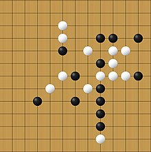

# Pente-Playing-AI-Bot

Pente is an abstract strategy board game for two or more players, created in 1977 by Gary Gabrel.

Pente is played on a 19x19 grid of intersections similar to a Go board. Players alternate placing stones of their color on empty intersections, with White always assuming the opening move. 

__The goal of the game__:  To either align five or more stones of the same color in a row in any vertical, horizontal or diagonal direction or to make five captures.

__Rules__:
1) Capture: if the stones are X O O _ and "X" places their stone so it becomes X O O X, then the opponent's stones are removed from the board, leaving X _ _ X.
2) Captures only happen when a capturing piece is placed. Therefore, if the board is XO_X and O places a piece in the free intersection, the board formation becomes XOOX and no capture happens by X
3) First piece (White) must be placed in the middle of the board.
4) The second move of White (first player) cannot be less than 3 intersections away from their first piece (center). This is one of the rules that alleviates the first player advantage (FPA).
5) Pieces can be placed in any empty intersection (apart from the first player restrictions explained above).
6) Placed pieces cannot be removed from the board unless they are captured.

More details on the game can be found at https://en.wikipedia.org/wiki/Pente

__Input__: 
The file input.txt in the current directory of your program will be formatted as follows:
First line: A string BLACK or WHITE indicating which color you play. White will always start 
the game.
Second line: A strictly positive floating point number indicating the amount of play time 
remaining for your agent (in seconds).
Third line: Two non-negative 32-bit integers separated by a comma indicating the number of 
pieces captured by White and Black players consecutively. Caution, it will always 
be ordered as first captured by White, then by Black, irrespective of what color is 
given in the first line.
Next 19 lines: Description of the game board, with 19 lines of 19 symbols each:
§ w for a cell occupied by a white piece
§ b for a cell occupied by a black piece
§ . (a dot) for an empty intersection
 
For example:
 
BLACK
 
100.0
 
0,0
 
...................
 
................... 
................... 
................... 
................... 
................... 
................... 
.........w......... 
..........b........ 
.........w.bw...... 
................... 
................... 
................... 
................... 
................... 
................... 
................... 
................... 
................... 

__Output__:
The format we will use for describing the square positions is borrowed from the notations from Pente.org, where every column is described by a letter and every row is described by a number. The position for a given square is given as the concatenation of these.

  

__My Implementation__:

To ensure I make informed decisions, I've harnessed the power of the Minimax Algorithm, coupled with a meticulously crafted evaluation function, to uncover the optimal moves. 

#### Minimax Algorithm
The Minimax Algorithm explores a tree of possible moves, assuming both players are striving for optimal outcomes. By recursively evaluating each move, I ensure that I not only anticipate my opponent's choices but also make the most strategic decisions myself.

#### Evaluation Function
To assign values to different game states and moves, I've devised an ingenious evaluation function. This function carefully considers multiple factors to gauge the desirability of a particular move:
    On the level of heirarchy:
    i.  Victory and Defeat - This is the ultimate goal, and the algorithm prioritizes moves that lead to a win.
    ii. Creating Strong Positions - Reward the creation of sequences of player's pieces, particularly those with four in a row.
    iii.  Strategic Captures - The number of possible captures is another vital determinant. By calculating potential captures, a player ensure his moves not only bolster the position but also weaken the opponent's prospects. 
    iv. Building Momentum - Forming sequences of three of a players pieces in a row is also advantageous. It sets the stage for further advancements and keeps the momentum firmly on their side.

__Optimizations__:

The intricacies of strategic games often lead to a sprawling game tree, which can be overwhelming to navigate. To address this challenge, I've deployed some astute optimizations:
1) Spatial Reduction: To tame the exponential growth of the recursion tree, I've ingeniously reduced the board size to a minimal yet effective representation. By considering only the two rows and columns surrounding the occupied cells, I strike a balance between precision and efficiency.
2) Time Reduction: Reduced the number of traversals by optimizing the for loop and making just 1 traversal for horizontal, vertical and diagonal travels.